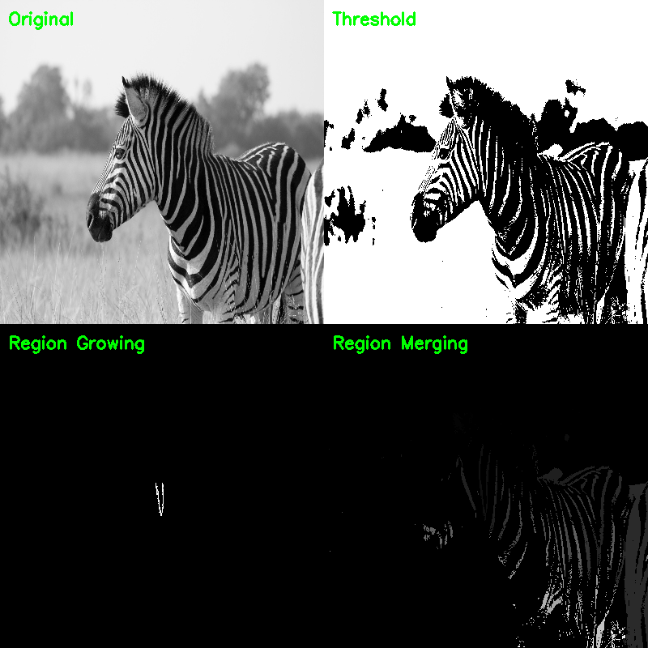

# Assignment


## Interpolation Methods

Interpolation is used to resize images by estimating new pixel values based on existing ones.

The following methods are implemented:

* Nearest Neighbor: Produces a pixelated (blocky) image due to direct value assignment
* Bilinear: Produces a smoother image using linear interpolation of neighboring pixels
* Bicubic: Produces a sharper and higher-quality image using cubic interpolation

### Output


---

## Region-Based Segmentation

Region-based segmentation groups pixels based on similarity in intensity or other properties.

The following methods are implemented:

* Thresholding: Separates foreground and background using intensity values
* Region Growing: Expands regions from a selected seed point based on similarity
* Region Merging: Combines adjacent regions with similar characteristics

### Output



---

## Edge-Based Segmentation

Edge-based segmentation detects boundaries by identifying significant changes in intensity.

The following methods are implemented:

* Sobel Operator: Gradient-based edge detection
* Laplacian Operator: Second-order derivative method
* Canny Edge Detector: Multi-stage algorithm for accurate edge detection
* Hough Transform: Detects and links edges in the form of lines

### Output


---

## Requirements

The following libraries are required:

* Python
* OpenCV
* NumPy

Install dependencies using:

```bash
pip install opencv-python numpy
```

---

## Execution

Run the programs using:

```bash
python interpolation_methods.py
python region_based_segmentation.py
python edge_based_segmentation.py
```

---

## Conclusion

This project illustrates the differences between interpolation techniques and demonstrates both region-based and edge-based approaches to image segmentation. Each method provides distinct advantages depending on the application and image characteristics.

---

## Author

Aachu Anna Sony


